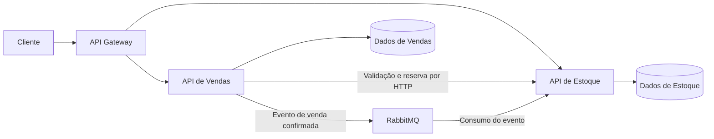

# PRD — Sistema de Estoque e Vendas

## 1. Objetivo

Planejar uma aplicação backend de e-commerce com dois microsserviços: Gestão de Estoque e Gestão de Vendas. O projeto deve permitir cadastrar produtos, criar e consultar pedidos e atualizar o estoque após uma venda.

Este documento foi elaborado com base nas imagens do desafio técnico e organiza o trabalho para uma pessoa iniciante. Ele contém requisitos e planejamento; não implementa a aplicação.

## 2. Requisitos do desafio

- C# e .NET para desenvolver APIs REST.
- Entity Framework com banco de dados relacional.
- Microsserviço de Estoque para cadastro, consulta e controle de produtos.
- Microsserviço de Vendas para criação e consulta de pedidos.
- Validação de estoque antes da confirmação do pedido.
- RabbitMQ para comunicação assíncrona, especialmente para notificar vendas e atualizar o estoque.
- API Gateway como ponto de entrada das requisições dos clientes.
- JWT para autenticação, com permissões específicas para cada ação.
- Validação das entradas, tratamento de exceções e separação de responsabilidades.

Testes unitários, monitoramento e logs e melhorias de escalabilidade aparecem como extras nas imagens.

## 3. Escopo

### Entrega principal

- Cadastro e consulta de produtos.
- Consulta da quantidade disponível em estoque.
- Criação de pedidos com validação de disponibilidade.
- Consulta de pedidos e seus status.
- Notificação de venda pelo RabbitMQ e atualização do estoque.
- Autenticação e autorização.
- Acesso às APIs pelo Gateway.
- Documentação para executar e demonstrar o sistema.

### Fora do escopo inicial

As imagens não exigem interface visual, pagamentos, frete, cupons, carrinho persistente, recuperação de senha ou implantação em nuvem. Essas funcionalidades não fazem parte deste planejamento inicial.

## 4. Decisões propostas

As decisões abaixo complementam o enunciado e podem ser ajustadas durante o desenvolvimento:

- Cada microsserviço será responsável pelos próprios dados e pela própria persistência. Um serviço não acessará diretamente as tabelas do outro.
- O serviço de Vendas consultará o serviço de Estoque por HTTP para verificar produtos, preços e disponibilidade.
- O RabbitMQ transportará os eventos de venda que desencadeiam a baixa do estoque.
- A organização inicial de cada API será simples: Controllers, Services, Models, DTOs e Data.
- O banco relacional, as versões compatíveis das dependências e a tecnologia do Gateway serão definidos na preparação do ambiente.
- O login poderá usar usuários de demonstração previamente cadastrados. A localização do componente emissor de JWT será definida antes da etapa de autenticação, sem exigir um terceiro microsserviço de negócio.

## 5. Arquitetura planejada

O Gateway encaminha as requisições. As regras de produtos e pedidos permanecem nos serviços responsáveis. As APIs também devem validar a autenticação e as permissões para impedir que o acesso direto contorne a proteção do Gateway.

## 6. Perfis e permissões propostos

| Ação | Administrador | Cliente |
|---|---|---|
| Cadastrar produtos | Sim | Não |
| Consultar produtos e disponibilidade | Sim | Sim |
| Administrar estoque | Sim | Não |
| Criar pedidos | Sim | Sim |
| Consultar os próprios pedidos | Sim | Sim |

A consulta de um pedido deve verificar o usuário proprietário. Acesso administrativo a pedidos de outros usuários não integra o escopo inicial. Operações internas de reserva e baixa devem ser restritas à comunicação autorizada entre serviços.

## 7. Modelo de dados inicial

| Entidade | Campos principais |
|---|---|
| Produto | ID, nome, descrição, preço, quantidade em estoque |
| Pedido | ID, usuário, data de criação, status, valor total |
| Item do pedido | ID, pedido, produto, quantidade, preço unitário da compra |

Status propostos: `Pendente`, `Confirmado` e `Rejeitado`.

Para tratar concorrência e repetição de mensagens, planejar também registros de reservas e de eventos processados. Uma reserva deve identificar o pedido, os produtos, as quantidades e sua situação.

## 8. Regras de negócio

### Produtos e estoque

- Nome obrigatório.
- Preço maior que zero, representado com tipo decimal.
- Quantidade de estoque não negativa.
- Apenas o serviço de Estoque altera as quantidades dos produtos.
- Uma atualização nunca pode produzir estoque negativo.

### Pedidos

- O pedido deve ter pelo menos um item.
- Cada item deve ter quantidade inteira maior que zero.
- Todos os produtos devem existir e ter disponibilidade suficiente.
- Itens repetidos do mesmo produto devem ser agrupados antes de validar as quantidades.
- Os preços devem ser obtidos pelo sistema, sem confiar em valores enviados pelo cliente.
- O preço unitário deve ser preservado no item do pedido, mesmo que o preço do produto mude posteriormente.
- O total corresponde à soma de quantidade multiplicada pelo preço unitário de cada item.
- Pedidos inválidos não podem ser confirmados.
- Se o Estoque estiver indisponível, Vendas não deve confirmar o pedido sem validação.

## 9. Fluxo da venda e consistência

O fluxo básico exigido é validar disponibilidade, confirmar o pedido e notificar o Estoque pelo RabbitMQ para realizar a baixa.

Uma consulta isolada não garante disponibilidade em compras simultâneas. Para a versão final, a proposta é usar reservas:

1. Vendas recebe e registra o pedido como pendente.
2. Solicita ao Estoque a validação e reserva de todos os itens.
3. Estoque verifica e reserva as quantidades em uma operação atômica: todos os itens são reservados ou nenhum é.
4. Sem disponibilidade, o pedido é rejeitado.
5. Com reserva válida, Vendas confirma o pedido e registra a necessidade de publicar o evento.
6. O evento de venda confirmada é publicado no RabbitMQ.
7. Estoque consome o evento, conclui a baixa e libera a quantidade reservada correspondente na mesma transação.

A disponibilidade para novas compras será a quantidade física menos a quantidade reservada. A conclusão da baixa não pode descontar a disponibilidade pela segunda vez.

### Falhas a tratar

- **Mensagem duplicada:** identificar cada evento e registrar seu processamento junto com a baixa, evitando desconto repetido.
- **Falha no consumidor:** confirmar o recebimento da mensagem somente após persistir a atualização; prever tentativas limitadas e encaminhamento de falhas para análise.
- **Falha ao publicar:** manter no banco de Vendas um registro de publicação pendente, salvo na mesma transação do pedido confirmado, para permitir reenvio. Esse mecanismo é conhecido como outbox.
- **Venda não concluída:** liberar a reserva por operação idempotente. Reservas antigas precisam de reconciliação com a situação do pedido; não devem expirar cegamente quando uma venda já foi confirmada e o evento está atrasado.
- **Falha entre serviços:** definir recuperação dos pedidos pendentes, consultando a reserva pelo identificador do pedido antes de repetir ou desfazer operações.

Reservas e outbox são decisões técnicas propostas, não requisitos textuais das imagens. Podem ser estudadas após o fluxo básico, mas os limites de uma versão sem esses mecanismos precisam ficar documentados.

## 10. Contratos de API planejados

| Método | Rota | Finalidade |
|---|---|---|
| POST | `/auth/login` | Autenticar e obter JWT |
| POST | `/produtos` | Cadastrar produto |
| GET | `/produtos` | Listar produtos |
| GET | `/produtos/{id}` | Consultar produto e disponibilidade |
| POST | `/pedidos` | Criar pedido |
| GET | `/pedidos` | Listar pedidos do usuário autenticado |
| GET | `/pedidos/{id}` | Consultar pedido autorizado |

As operações internas de reserva, liberação e ajuste de estoque serão detalhadas durante a integração. Elas não devem ser expostas como operações públicas sem autorização específica.

Respostas previstas: `201` para criação concluída, `400` para entrada inválida, `401` para autenticação ausente ou inválida, `403` para falta de permissão, `404` para recurso inexistente e `409` para conflito de disponibilidade. Dependências indisponíveis devem gerar uma resposta controlada, sem expor detalhes internos.

## 11. Etapas de desenvolvimento

### Etapa 1 — Preparação

- Revisar C#, orientação a objetos, HTTP, JSON, APIs REST e conceitos básicos de banco relacional.
- Escolher o banco, as versões compatíveis e a solução de Gateway.
- Organizar a solução com Estoque, Vendas e Gateway.
- Definir configurações locais e tratamento de segredos.

**Concluída quando:** os projetos iniciam e as responsabilidades estão documentadas.

### Etapa 2 — Estoque

- Modelar Produto.
- Configurar Entity Framework e migrations.
- Implementar cadastro, listagem e consulta.
- Aplicar validações e tratamento de erros.

**Concluída quando:** um produto cadastrado pode ser consultado depois de reiniciar a aplicação.

### Etapa 3 — Vendas

- Modelar Pedido e Item do pedido.
- Persistir e consultar pedidos.
- Consultar Estoque por HTTP.
- Validar quantidades, obter preços e calcular o total.

**Concluída quando:** pedidos válidos são persistidos e pedidos sem disponibilidade não são confirmados.

### Etapa 4 — Mensageria e consistência

- Configurar RabbitMQ, publicação e consumo.
- Definir o evento com ID, ID do pedido, produtos e quantidades.
- Implementar a baixa de estoque e proteção contra eventos duplicados.
- Evoluir o fluxo com reserva, recuperação de falhas e publicação persistente.

**Concluída quando:** uma venda reduz o estoque uma única vez e compras simultâneas não geram estoque negativo.

### Etapa 5 — Autenticação e autorização

- Definir o componente de login e usuários de demonstração.
- Emitir e validar JWT, incluindo assinatura, emissor, destinatário e expiração.
- Aplicar permissões por perfil e propriedade dos pedidos.
- Guardar senhas com hash e manter chaves e credenciais fora do código versionado.

**Concluída quando:** acesso sem token e operações sem permissão são recusados.

### Etapa 6 — Gateway

- Configurar o encaminhamento das rotas.
- Integrar a proteção das requisições e o envio do token às APIs.
- Demonstrar o fluxo completo pelo ponto de entrada único.

**Concluída quando:** cadastro, consulta e criação de pedidos funcionam pelo Gateway.

### Etapa 7 — Validação e documentação

- Executar os cenários de aceitação.
- Documentar execução, configurações, usuários de demonstração e exemplos de requisições.
- Registrar decisões técnicas e limitações conhecidas.
- Adicionar os extras conforme disponibilidade.

**Concluída quando:** outra pessoa consegue executar e demonstrar o sistema seguindo o README.

## 12. Cenários de aceitação

| Cenário | Resultado esperado |
|---|---|
| Cadastrar produto válido com dez unidades | Produto persistido e consultável |
| Cadastrar produto com preço inválido | Requisição recusada com mensagem clara |
| Comprar duas das dez unidades | Pedido confirmado e estoque final com oito unidades após processamento |
| Comprar acima da disponibilidade | Pedido não confirmado e estoque preservado |
| Pedir produto inexistente | Requisição recusada |
| Consultar pedido próprio | Dados e status retornados |
| Consultar pedido de outro cliente | Acesso negado, sem exposição de dados |
| Acessar rota protegida sem token ou com token expirado | Acesso recusado |
| Cliente tentar cadastrar produto | Operação recusada |
| Enviar requisições pelo Gateway | Encaminhamento ao serviço correto |
| Processar novamente o mesmo evento | Nenhuma baixa adicional |
| Duas compras disputarem a última unidade | No máximo uma venda confirmada |
| RabbitMQ ficar temporariamente indisponível | Evento pendente preservado para publicação posterior |

## 13. Extras e entrega final

Extras sugeridos pelas imagens:

- Testes unitários das regras de produtos e pedidos.
- Logs com identificação do pedido e do evento para acompanhar falhas.
- Melhorias que facilitem evolução e escalabilidade.

Outras facilidades opcionais: testes de integração do fluxo principal e configuração de containers para reproduzir o ambiente local.

A entrega final deve incluir o código dos serviços e Gateway, migrations, instruções de configuração e execução, exemplos de requisições, diagrama da arquitetura e limitações conhecidas.

**Ordem recomendada:** Estoque → Vendas → RabbitMQ e consistência → JWT e permissões → Gateway → validação e documentação.
