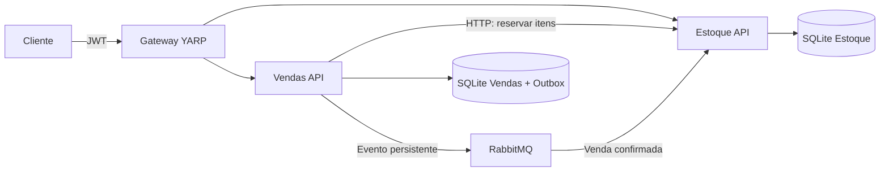

# Guia da implementação e preparação para entrevista

Este documento explica o que o projeto faz, onde encontrar cada parte e como apresentar as decisões. Estude os exemplos e execute o sistema para conseguir explicar com suas próprias palavras. As respostas abaixo são sugestões de estudo e devem corresponder ao que você compreendeu e demonstrou.

## 1. Como apresentar o projeto em um minuto

> O projeto é um backend de estoque e vendas em C# e .NET. Ele possui dois microsserviços: Estoque administra produtos e quantidades; Vendas administra pedidos. O cliente acessa tudo pelo API Gateway, que também oferece um login de demonstração com JWT. Antes de confirmar uma venda, Vendas solicita uma reserva ao Estoque. Depois, registra o pedido confirmado e um evento na mesma transação. Um publicador envia esse evento pelo RabbitMQ, e Estoque conclui a baixa. Há testes para impedir estoque negativo, desconto duplicado e perda do evento quando o broker fica indisponível.

Você pode começar com a responsabilidade dos serviços e detalhar os mecanismos de falha apenas se o recrutador pedir.

## 2. O que foi implementado

| Requisito | Implementação | Onde estudar |
|---|---|---|
| Cadastro, consulta e ajuste de produtos | Endpoints, DTOs, validações e persistência | `ProductsController`, `StockService` |
| Banco relacional com Entity Framework | Dois arquivos SQLite e migrations independentes | `StockDb`, `SalesDb`, pastas `Data/Migrations` |
| Criação e consulta de pedidos | Pedido, itens, total e propriedade do usuário | `OrdersController`, `OrderService` |
| Verificação de estoque | Reserva atômica antes da confirmação | `StockService.Reserve` |
| RabbitMQ | Publicador da outbox e consumidor de vendas | `OutboxPublisher`, `SaleConsumer`, `Rabbit` |
| JWT e permissões | Assinatura, validade, emissor, audiência e perfis | `AuthController`, `WebSetup` |
| Gateway | YARP com rotas públicas de produtos e pedidos | `Gateway/Program.cs` |
| Organização e POO | Classes com responsabilidades separadas e injeção de dependências | Controllers, Services, DTOs e Models |
| Tratamento de erros | Validação HTTP, exceções de negócio e resposta padronizada para falhas inesperadas | `WebSetup`, `BusinessException` |
| Extras | Testes automatizados e logs com identificadores | `tests/Desafio.Tests`, `scripts/smoke.py` |

A solução usa .NET 8 porque esse SDK estava disponível no ambiente. As versões exatas dos pacotes estão nos arquivos `.csproj`; não é necessário decorar os números para explicar a arquitetura.

## 3. Como as partes conversam

- **HTTP:** usado quando Vendas precisa obter a resposta da reserva antes de confirmar.
- **RabbitMQ:** usado para transmitir a notificação da venda e permitir que a baixa seja processada posteriormente.
- **Gateway:** recebe as chamadas dos clientes e as encaminha. Não calcula pedidos nem altera estoque.
- **Bancos separados:** cada serviço é dono dos próprios dados. O banco de Vendas guarda o ID do produto, mas não tem uma chave estrangeira para o banco de Estoque.

Nesta implementação, a chamada interna de Vendas a Estoque é direta pela rede dos serviços. O Gateway centraliza a entrada dos clientes; o RabbitMQ transporta a comunicação assíncrona. Essa é a interpretação adotada para o desenho do desafio.

## 4. Exemplo completo: vender duas unidades

Imagine um teclado de R$ 100,00 com dez unidades.

1. O administrador cadastra o produto em `POST /produtos`.
2. O cliente faz login e recebe um JWT válido por 30 minutos.
3. Envia `POST /pedidos` com o ID do teclado e quantidade dois.
4. Vendas valida a entrada, agrupa itens repetidos e salva o pedido como `Pendente`.
5. Vendas faz uma chamada HTTP autenticada ao Estoque para reservar duas unidades.
6. Estoque verifica todos os itens e salva a reserva em uma transação.
7. A resposta inclui o preço do produto; Vendas calcula o total de R$ 200,00.
8. Vendas salva `Confirmado` e o evento na outbox com um único `SaveChanges` transacional.
9. O publicador envia a mensagem ao RabbitMQ e aguarda a confirmação do broker.
10. Estoque recebe a mensagem e, em uma transação, reduz a quantidade física, libera a reserva e registra o evento processado.
11. Somente depois dessa gravação o consumidor confirma o recebimento da mensagem.

| Momento | Quantidade física | Reservada | Disponível |
|---|---:|---:|---:|
| Antes da compra | 10 | 0 | 10 |
| Após reservar | 10 | 2 | 8 |
| Após consumir o evento | 8 | 0 | 8 |

A fórmula é `disponível = quantidade física - reservada`. A disponibilidade não deve cair duas vezes para a mesma venda.

## 5. Por que reservar em vez de apenas consultar?

Duas pessoas podem consultar uma última unidade quase ao mesmo tempo. Se o sistema apenas consultar e depois confirmar, ambas podem receber uma confirmação.

A reserva combina verificação e alteração em uma transação de escrita no SQLite. Uma operação espera a outra terminar; quando a segunda verifica a disponibilidade, encontra a unidade já reservada. As restrições do banco também impedem quantidades negativas e reservas maiores que o estoque físico.

**Resposta possível:** “Consultar informa o estoque naquele instante. Reservar garante que aquelas unidades ficam separadas para o pedido antes de confirmar a venda.”

Essa estratégia foi testada com chamadas concorrentes. Não significa que o sistema foi testado sob alta carga ou que SQLite é a escolha para qualquer escala.

## 6. O que é outbox?

É uma tabela no banco de Vendas que guarda eventos ainda não publicados.

Sem ela, seria possível salvar um pedido confirmado e o processo cair antes de enviar a mensagem. O pedido existiria, mas o Estoque não receberia a notificação.

Aqui, a confirmação do pedido e a inclusão do evento são gravadas na mesma transação local. Se a gravação falha, ambas são desfeitas. Se o RabbitMQ estiver fora do ar, o evento permanece na tabela e o publicador tenta depois.

**Resposta possível:** “A outbox fecha a lacuna entre salvar no banco e publicar na fila. Ela preserva a intenção de publicar junto com o pedido.”

A marcação de publicação ocorre após a confirmação do RabbitMQ. Se o processo cair entre o envio e essa marcação, o evento poderá ser publicado novamente. Por isso, o consumidor também precisa ser idempotente.

## 7. O que é idempotência?

É poder repetir uma operação sem repetir indevidamente seu efeito.

O projeto aplica isso em três lugares:

- **Reserva:** repetir o mesmo ID de pedido com os mesmos itens retorna a reserva existente.
- **Liberação:** liberar novamente uma reserva não devolve unidades em dobro. Uma marca de liberação também bloqueia requisições atrasadas.
- **Baixa:** o consumidor registra o ID do evento na mesma transação que altera o estoque. Também verifica se a reserva do pedido já foi concluída.

**Resposta possível:** “Se a mensagem chegar duas vezes, o estoque é descontado uma só vez. Não dependo de a fila entregar exatamente uma vez.”

A criação pública do pedido ainda não aceita uma chave de idempotência. Reenviar `POST /pedidos` cria outro pedido. A proteção implementada é das operações internas e do processamento do evento.

## 8. O que acontece quando algo falha?

| Falha | Comportamento |
|---|---|
| Estoque insuficiente | Reserva não é feita e o pedido fica rejeitado |
| Um item indisponível em pedido com vários itens | Toda a reserva é desfeita |
| API de Estoque indisponível | Pedido fica pendente; API retorna `202` e o worker tenta novamente |
| Processo cai depois da reserva e antes da confirmação | Pedido pendente é retomado, reutilizando a reserva e seus preços |
| RabbitMQ indisponível | Pedido confirmado mantém evento na outbox e unidades reservadas |
| Processo reinicia após publicar, antes de marcar publicação | Pode reenviar o evento; consumidor impede baixa duplicada |
| Consumidor falha antes de concluir a gravação | Mensagem não é confirmada como processada |
| Mensagem falha três vezes na execução do consumidor | É encaminhada à fila de erros para análise |

As três tentativas do consumidor acontecem por entrega; uma queda do processo antes da confirmação pode provocar uma nova entrega. A fila de erros não possui reprocessamento automático.

Os pedidos pendentes seguem uma estratégia de **tentar concluir a venda**, sem prazo automático de expiração. A API interna possui liberação de reservas, mas não há cancelamento público nem um processo de cancelamento distribuído. Isso evita liberar às cegas uma reserva de venda já confirmada cujo evento está apenas atrasado.

## 9. JWT: autenticação e autorização

**Autenticação** identifica quem está fazendo a chamada. **Autorização** verifica se essa pessoa pode realizar a ação.

O Gateway verifica as credenciais dos três usuários de demonstração. As senhas são verificadas com PBKDF2, sal aleatório e comparação em tempo constante. O `.env` guarda também as senhas locais de demonstração para permitir os testes; o Gateway recebe os hashes.

O JWT contém:

- `sub`: identificador do usuário.
- `role`: `Administrador` ou `Cliente`.
- `exp`: expiração.
- `iss` e `aud`: emissor e destinatário esperados.
- `jti`: identificador do token.

O Gateway e as APIs verificam assinatura, emissor, destinatário e validade. O token é assinado, **não criptografado**: não deve carregar senhas ou segredos.

Administradores cadastram e ajustam produtos; clientes consultam produtos e criam pedidos. Cada usuário só consulta seus próprios pedidos. A checagem usa o usuário extraído do token, não um ID enviado pelo cliente.

As rotas internas usam outra credencial, `X-Internal-Key`, e não estão roteadas pelo Gateway. Um JWT de cliente não substitui essa credencial interna.

**Limite:** o login é uma simplificação para o desafio, sem provedor de identidade, cadastro real, refresh token ou revogação imediata. Em produção, identidade e credenciais exigiriam uma solução mais completa.

## 10. Como o código está organizado

- **Controller:** entende a requisição HTTP e monta a resposta.
- **DTO:** define os dados aceitos ou devolvidos pela API.
- **Service:** executa as regras de negócio.
- **Model:** representa os dados persistidos.
- **DbContext:** conecta as entidades ao banco por meio do Entity Framework.
- **Migration:** registra a criação e evolução da estrutura do banco.
- **BackgroundService:** executa tarefas contínuas, como publicar eventos e retomar pendências.

As dependências são fornecidas pelo contêiner de injeção do .NET. Por exemplo, `OrderService` recebe o banco, o cliente de Estoque e o logger, em vez de criá-los por conta própria.

Não foi criada uma camada genérica de repositório sobre o Entity Framework. Para este tamanho de projeto, o DbContext já oferece as operações necessárias, e outra camada adicionaria código sem uma necessidade concreta.

## 11. Perguntas comuns do recrutador

**Por que microsserviços?**

“Foi um requisito do desafio. Separei Estoque e Vendas por responsabilidade e propriedade dos dados. Essa separação permite evolução independente, mas adiciona rede, falhas parciais e consistência eventual. Para um sistema pequeno sem esse requisito, um monólito modular também seria uma opção.”

**Por que SQLite?**

“É relacional, funciona com Entity Framework e facilita executar a demonstração sem configurar dois servidores de banco. Cada serviço usa seu próprio arquivo e volume. A escolha prioriza aprendizado e execução local; para várias réplicas eu avaliaria um banco servidor e revisaria a concorrência.”

**Por que usar `decimal` nos preços?**

“Para representar valores monetários com precisão decimal. O cadastro aceita até duas casas e o pedido preserva o preço no momento da reserva.”

**Por que guardar o preço no item do pedido?**

“Porque o preço do catálogo pode mudar. Uma compra antiga deve manter o valor acordado quando foi feita.”

**O que significa consistência eventual neste projeto?**

“O pedido pode estar confirmado antes de a quantidade física ser baixada. As unidades já estão reservadas, então não ficam disponíveis para outra venda. A mensagem faz o Estoque alcançar o estado final depois.”

**O RabbitMQ garante que a mensagem seja processada só uma vez?**

“Não conto com isso. Uso mensagens persistentes, fila durável e confirmação do broker; no consumidor, confirmo depois de salvar e trato duplicação. As garantias de publicação e processamento são diferentes.”

**O que o Gateway faz?**

“Centraliza a entrada dos clientes, valida a autenticação e encaminha produtos e pedidos aos serviços certos. As APIs também validam as permissões.”

**O sistema já escala horizontalmente?**

“Não. A organização separa os serviços, mas esta entrega roda uma instância de cada. SQLite, o semáforo de Vendas e o publicador precisariam ser revistos para múltiplas réplicas.”

**O que você melhoraria primeiro?**

“Acrescentaria idempotência na criação pública do pedido, paginação, observabilidade das pendências e reprocessamento operacional. Para produção, também revisaria identidade, HTTPS, banco servidor, concorrência entre réplicas e implantação das migrations.”

## 12. Roteiro de demonstração

1. Execute os comandos do README.
2. Mostre o cadastro de um produto com dez unidades.
3. Faça uma compra de duas e consulte o pedido.
4. Mostre o estoque final com oito unidades.
5. Tente comprar uma quantidade maior que a disponível.
6. Mostre que uma chamada sem token retorna `401`.
7. Mostre que cliente não pode cadastrar produto: `403`.
8. Explique o isolamento de pedidos entre `cliente` e `cliente2`.
9. Execute `dotnet test` e apresente o propósito dos testes.
10. Se houver tempo, execute `python3 scripts/smoke.py --resilience` para demonstrar recuperação de falhas reais.

O teste de resiliência interrompe temporariamente os containers do projeto. Faça essa demonstração com o ambiente local dedicado a ela.

## 13. Ordem sugerida para estudar

1. `Models` e `DTOs`: entenda os dados e os contratos.
2. `ProductsController` e `StockService.Create`: siga um cadastro simples.
3. `OrdersController` e `OrderService`: acompanhe um pedido.
4. `StockService.Reserve`: entenda transação e disponibilidade.
5. `OutboxPublisher` e `SaleConsumer`: acompanhe a mensagem.
6. `WebSetup` e `AuthController`: revise as permissões.
7. Leia e execute os testes, alterando um cenário de cada vez em seu ambiente de estudo.

Procure conseguir desenhar o fluxo sem consultar o código e explicar o caso das duas compras da última unidade. São bons sinais de entendimento da solução.

## 14. Referências oficiais

- [Autenticação JWT no ASP.NET Core](https://learn.microsoft.com/en-us/aspnet/core/security/authentication/configure-jwt-bearer-authentication): configuração de validação dos tokens.
- [Autenticação e autorização no YARP](https://learn.microsoft.com/en-us/aspnet/core/fundamentals/servers/yarp/authn-authz): políticas de acesso às rotas do proxy.
- [Guia do cliente .NET do RabbitMQ](https://www.rabbitmq.com/client-libraries/dotnet-api-guide): conexões, canais e operações do cliente.
- [Confirmação de publicação e confirmação de consumo](https://www.rabbitmq.com/docs/confirms): diferença entre a responsabilidade do publicador e a do consumidor.
